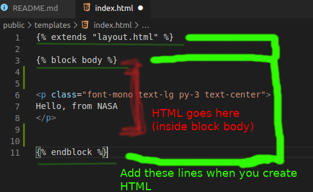

# NASA_Cov19
> Just another project. :)
<p align="center">
  
</p>
<p align="center">
[![NPM Version][npm-image]][npm-url]
[![Build Status][travis-image]][travis-url]
</p>


Consider climatic conditions to evaluate the spead of Covid-19.


## Installation

OS X & Linux:

```sh
pip3 install -r requirements.txt
python3 wsgi.py
```

Windows:

```sh
pip install -r requirements.txt
python wsgi.py
```

## Usage example



_For more examples and usage, please refer to the [Flask Doc][wiki]._

## Development setup

Python3 and pip should be installed. 

```sh
pip install virtualenv
virtualenv nasa
source nasa/bin/activate (for Linux and Mac)
\nasa\Scripts\activate (for Windows)

pip install -r requirements.txt
python wsgi.py (for Windows)
python3 wsgi.py (for Linux)
```


## Contributing

1. Fork it (<https://github.com/ayushmankumar7/covid-nasa/fork>)
2. Create your feature branch (`git checkout -b feature/fooBar`)
3. Commit your changes (`git commit -am 'Add some fooBar'`)
4. Push to the branch (`git push origin feature/fooBar`)
5. Create a new Pull Request

<!-- Markdown link & img dfn's -->
[npm-image]: https://img.shields.io/npm/v/datadog-metrics.svg?style=flat-square
[npm-url]: https://npmjs.org/package/datadog-metrics
[npm-downloads]: https://img.shields.io/npm/dm/datadog-metrics.svg?style=flat-square
[travis-image]: https://img.shields.io/travis/dbader/node-datadog-metrics/master.svg?style=flat-square
[travis-url]: https://travis-ci.org/dbader/node-datadog-metrics
[wiki]: https://flask.palletsprojects.com/en/1.1.x/tutorial/templates/
